## Forest Carbon Stock Estimation via Reasoning Segmentation

### Goal
드론·항공 RGB 영상에서 수종 군집을 식별하고, 해당 영역의 탄소 저장량과 생태 상태를 설명하는 **산림 특화 멀티모달 시스템**을 개발하는 것이다. \
단순한 수종 군집 별 segmentation을 넘어 수관, 수고, 흉고직경(DBH), 탄소량, 수목 건강상태를 연결해 산림 관리, 탄소 모니터링 보고서까지 생성하는 것을 목표로 한다. 

Large Multimodal Model(LMM)인 GLaMM을 활용하여 수종 군집 별 segmentation mask, 군집 별 설명을 생성하고, \
이를 기반으로 해당 군집의 탄소 저장량 계산(탄소 저장량 공식 활용), 더 나아가 영상에 찍힌 산림의 총 탄소 저장량 계산 및 산림의 건강 상태 모니터링까지 출력한다. 

### 구상한 아키텍처
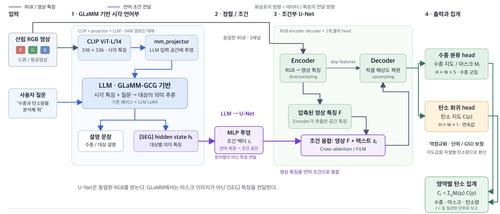

**파이프라인** \
GLaMM이 분석할 대상을 지정하고, U-Net이 해당 대상의 위치와 탄소량을 픽셀 단위로 예측하는 파이프라인을 계획 
1. **영상·질문 이해**: 산림 RGB 영상을 CLIP으로 인코딩하고, 시각 특징과 사용자 질문을 LLM에 전달 
2. **언어 조건 생성**: LLM은 설명 문장과 대상별 [SEG] hidden state를 생성합니다. 이를 MLP로 투영해 U-Net에 전달할 조건 벡터 생성 
3. **조건부 영상 분석**: U-Net은 동일한 RGB에서 영상 특징을 추출하고, Cross-attention 또는 FiLM으로 언어 조건과 융합 Decoder는 skip connection을 활용해 픽셀 해상도를 복원
4. **수종·탄소량 출력**: 두 출력 head가 수종 지도·마스크와 탄소 지도를 생성합니다. 탄소값의 역정규화·단위·픽셀 면적 보정 후, 수종별 마스크 영역의 탄소량을 합산
5. **최종 출력 생성**: LLM의 언어 출력과 U-Net의 탄소량 출력을 융합하여 최종 출력을 생성

### 데이터셋
- iNaturalist
- PlantVillage
- NEON
- AI-hub **"식생 탄소 포집량 식별 데이터"**
- 위 데이터를 이용해 직접 제작한 데이터셋

### 결과
**일반적인 나무 이미지** \
input

output

> Based on my expert ecological analysis of this scene, &lt;p&gt;grass&lt;/p&gt;  [SEG]  is flourishing in the field, with a &lt;p&gt;tree &lt;/p&gt;  [SEG]  standing tall and attached to it. The tree is located in the midst of a lush, vibrant field, which also contains flowers. The area is enclosed by a &lt;p&gt; mountain &lt;/p&gt;  [SEG]  , and the &lt;p&gt; sky &lt;/p&gt;  [SEG]  is visible above the tree. The tree is attached to the grass, indicating the presence of &lt;p&gt; sand &lt;/p&gt;  [SEG]  . The scene is a bright, sunny landscape, and there is a significant presence of biomass.&lt;/s&gt;

input
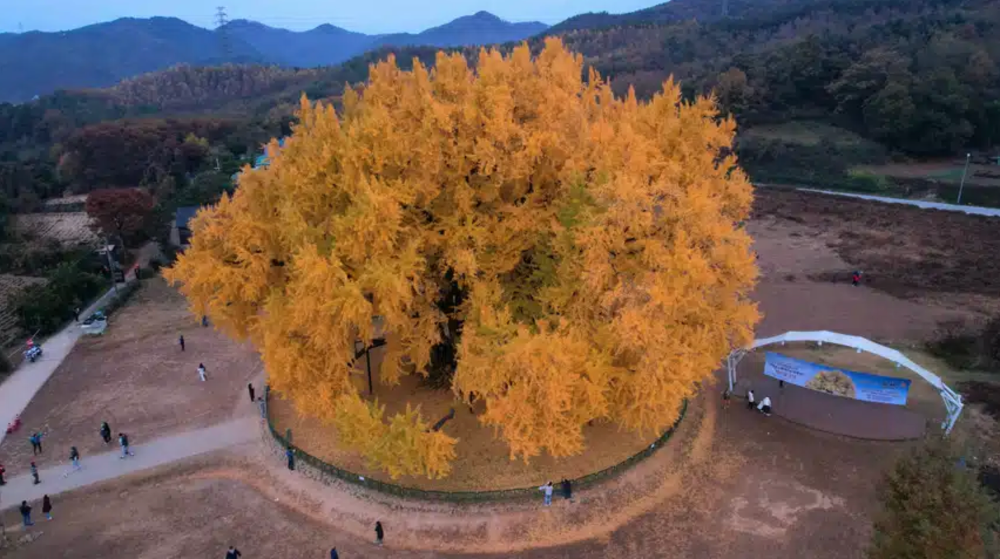
output
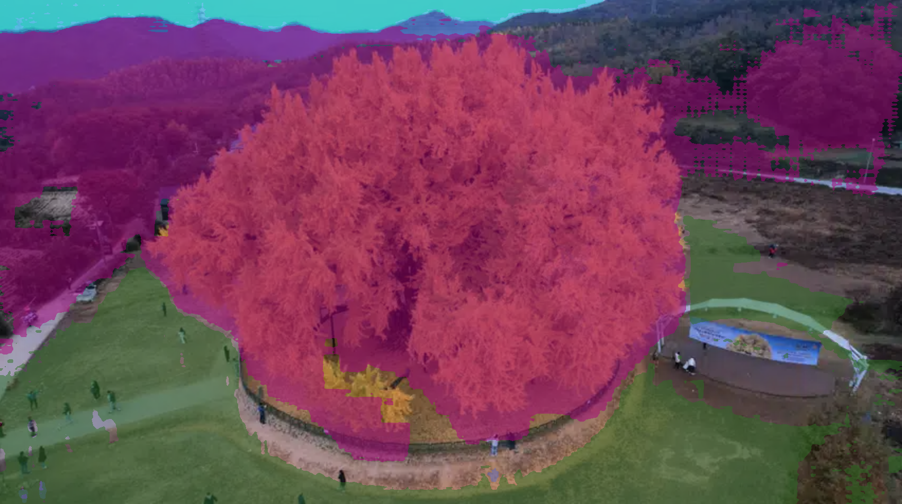
>Based on my expert ecological analysis of this scene, &lt;p&gt;person-1 &lt;/p&gt; [SEG]  is standing on &lt;p&gt;  dirt &lt;/p&gt; [SEG]  , which is attached to a long-haired &lt;p&gt;  tree &lt;/p&gt;[SEG]  . This tree is located in the center of a large, bright yellow tree and some bushes, all under the expansive &lt;p&gt; sky &lt;/p&gt; [SEG]  . The sky is also seen stretching over the entire landscape, across the entire field of tall, orange trees with trees standing on the ground. The area is a vast open field with trees growing out of the ground, indicating a marked vegetation area with a high tree cover.&lt;/s&gt;

input
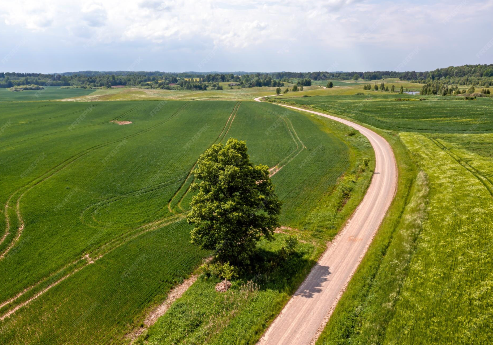
output
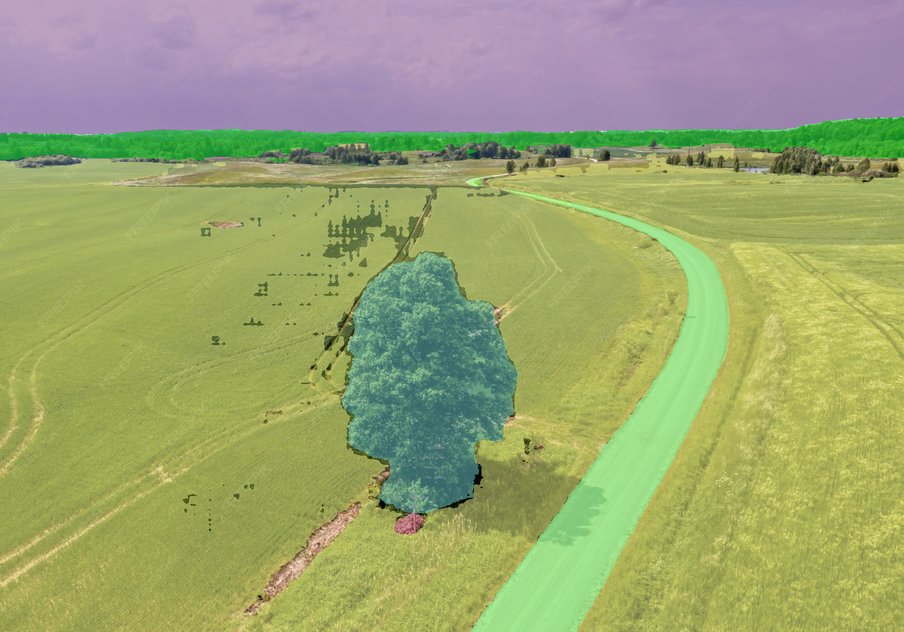
>Based on my expert ecological analysis of this scene, &lt;p&gt;gravel &lt;/p&gt; [SEG]  and &lt;p&gt; grass &lt;/p&gt; [SEG]  are attached to the &lt;p&gt;road &lt;/p&gt;  [SEG]  , indicating a blend of farmless and pasture. Beside this road, a &lt;p&gt; tree &lt;/p&gt; [SEG]  is situated on the gravel, which is part of a large green field. The vast&lt;p&gt;  sky &lt;/p&gt; [SEG]  stretches over the road, tree, grass, and a nearby &lt;p&gt;mountain &lt;/p&gt;  [SEG]  . The grass appears to be attached to the road, suggesting a rural, green landscape.&lt;/s&gt;

**항공 산림 이미지** \
input \
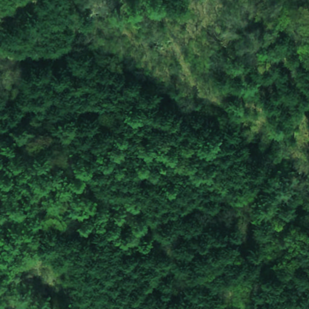
output\
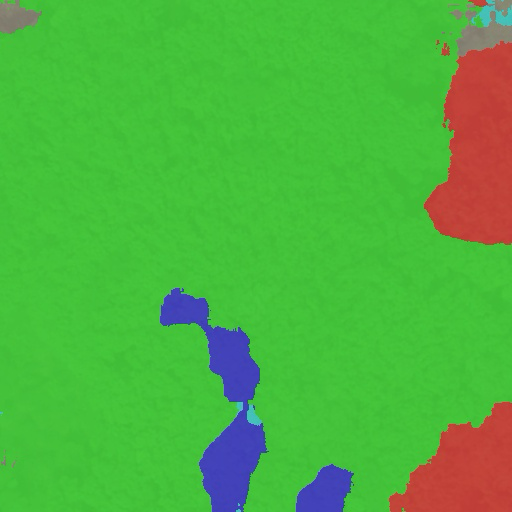
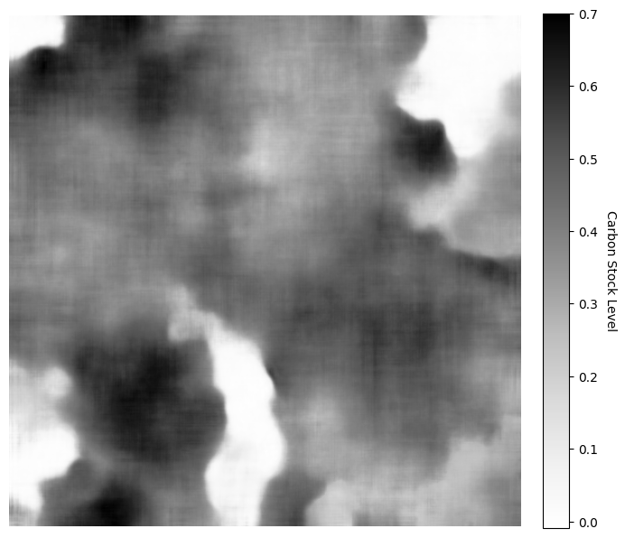
>"pred_text": "[SEG] [SEG] [SEG] [SEG] [SEG] [SEG] [SEG] [SEG] . . . . . . . . . It is [SEG] [SEG] [SEG] [SEG] [SEG] [SEG] [SEG] [SEG] [SEG] [SEG] [SEG] [SEG] [SEG] [SEG] [SEG] it it it it it it it it it it it it it it it [SEG] [SEG] [SEG] [SEG] [SEG] [SEG] [SEG] [SEG] [SEG] [SEG] [SEG] [SEG] [SEG] [SEG] &lt;p&gt; &lt;p&gt; &lt;p&gt; &lt;p&gt; &lt;p&gt; &lt;p&gt; &lt;p&gt; &lt;p&gt; &lt;p&gt; &lt;p&gt; &lt;p&gt; &lt;p&gt; &lt;p&gt; &lt;p&gt; &lt;p&gt; :  [SEG] [SEG] [SEG] [SEG] [SEG] [SEG]  it it it it it it it it it it it it it it  it  it  it  it  it  it  it  [SEG] [SEG] [SEG] [SEG] [SEG] [SEG] [SEG] [SEG] [SEG] [SEG] [SEG] [SEG] [SEG] [SEG] [SEG] [SEG] [SEG] [SEG] [SEG] [SEG] &lt;/p&gt; &lt;/p&gt; &lt;/p&gt; &lt;/p&gt; &lt;/p&gt; &lt;/p&gt; &lt;/p&gt; &lt;/p&gt; &lt;/p&gt; &lt;/p&gt; &lt;/p&gt; &lt;/p&gt; &lt;/p&gt; &lt;/p&gt; &lt;/p&gt; [SEG] [SEG] [SEG] [SEG] [SEG] [SEG] [SEG] [SEG] [SEG] [SEG] [SEG] [SEG] [SEG] [SEG] Sure, it is [SEG] [SEG] [SEG] [SEG] [SEG] [SEG] [SEG] [SEG] [SEG] [SEG] [SEG] [SEG] [SEG] Surely, the                Sure, the             Sure, [SEG] [SEG] [SEG] [SEG] [SEG] [SEG] [SEG] [SEG] [SEG] [SEG] [SEG] [SEG]", 

input \
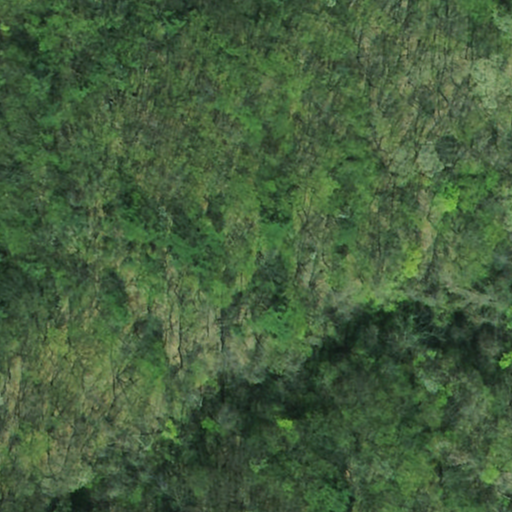

output \
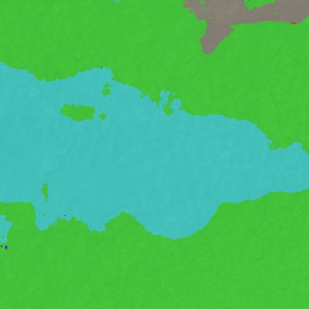
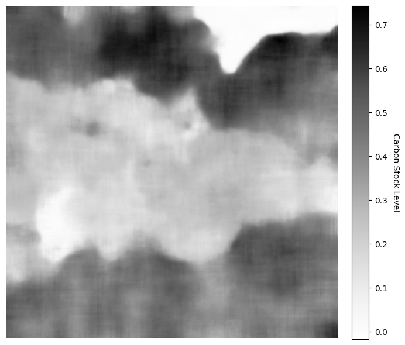

>"pred_text": "[SEG] . In addition, the &lt;p&gt; sky &lt;/p&gt; [SEG] 's over a 
 &lt;/p&gt; [SEG] - of a small body of a small body of a small body of a small body of a  &lt;/p&gt; &lt;/p&gt; &lt;/p&gt; &lt;/p&gt; &lt;/p&gt; [SEG]  it, it, it, it, it, it, it, it, [SEG] it, it, it, it, it, it, it,  [SEG]  it,  it,  it,  it,  it,  it.  [SEG]  it,  it,  it,  it, it, it, it, it, it, it.  it,  it,  it,  it,  it- it,  it,  it,  it,  it, it,  it,  it,  it,  it, [SEG]  it,  it,  it,  it,  [SEG]  it,  it,  it,  [SEG]  it, it, it, it, it, it,  it,  it,  it,  [SEG] [SEG]  it,  it,  it,  it, [SEG] [SEG]  it,  it,  it,  it.  it,  it,  it,  it,",

### 한계점
- 언어 생성 퇴화 문제 해결 못함
- GLaMM과 U-Net 사이의 정렬 문제 해결 못함
- 탄소 저장량 공식의 부정확함으로 인해 정확한 탄소 저장량 추론 불가
- GLaMM 모델의 4096 토큰 제한으로 인한 출력 정보 제한 존재
